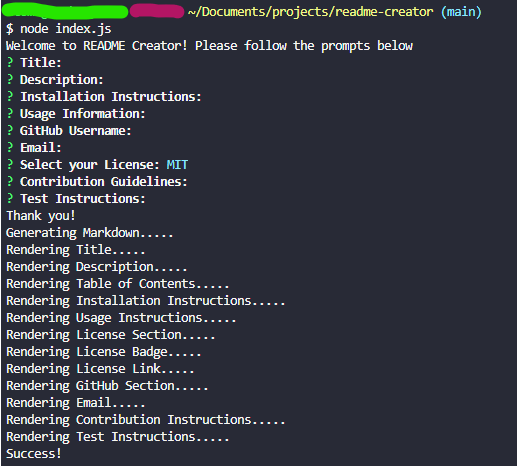

# Readme Creator
## Description

[Video Walkthrough](https://drive.google.com/file/d/19_hFuzARAdhmeSqaUb0yfeeF5K2VJMox/view)

This is a Readme Creator designed by Yoon-Jae Kim. The purpose of this program is to generate a professional README using the CLI. After running 'node index.js', the user will be put through a series of prompts using the inquirer module. After answering each question, a new README file will be created in the readme-folder directory. Methods used here were learned from NW Coding Bootcamp.

## Table of Contents
- [Installation](#installation)
- [Usage](#usage)
- [Credits](#credits)
- [License](#license)
- [How to Contribute](#how-to-contribute)
- [Tests](#tests)

## Installation
Clone the repo into your local machine, then run 'node index.js'. Make sure that node is already installed before running the command in your CLI.

## Usage
This project can be used by anyone looking to streamline their README creation process.

## Credits
### Github
[Yoonbacca](https://github.com/Yoonbacca)
### Email
[yoonjaekim3@gmail.com](yoonjaekim3@gmail.com)

## License
None

## How to Contribute
This is a solo project and does not require contributions at this time.

## Tests
You can test this program after following the installation instructions above.
  
